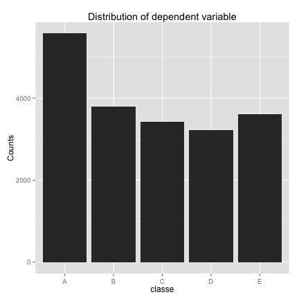

#


This report was automatically generated with the R package **knitr**
(version 1.10.5).


```r
##############################################
# LIBRARIES
# First, let's load all required libraries
##############################################

library('caret')     # learning
library('rattle')    # plotting of trees
library('knitr')     # HTML reports
# parallel computing to utilize multiple cores
library('doParallel')
registerDoParallel(cores=4)

##############################################
# DATA LOAD AND PRE-PROCESSING
# here, we load the dataset (both training and 20-sample testing)
# from csv files and drop about half of the columns
# (either because they are metadata unrelated to sensor measurements,
#  or because they contain NaNs)
##############################################

# 0. load the data, interpreting certain values as NaNs:
nans <- c("NA", "", "#DIV/0!")
pml_training <- read.csv('pml-training.csv', header=T, na.strings=nans)
pml_testing <- read.csv('pml-testing.csv', header=T, na.strings=nans)

# 1. A. drop irrelevant columns, such as event metadata, username, and various timestamps
#    B. filter out the columns where ALL values are NaNs
cols_all <- colnames(pml_training)
cols_drop = c('X', 'new_window', 'num_window', 'user_name',
              'raw_timestamp_part_1', 'raw_timestamp_part_2', 'cvtd_timestamp')
print(cat('Dropped', length(cols_drop), 'columns (reason: irrelevant metadata):', cols_drop))
```

```
## Dropped 7 columns (reason: irrelevant metadata): X new_window num_window user_name raw_timestamp_part_1 raw_timestamp_part_2 cvtd_timestampNULL
```

```r
cols_hasna <- cols_all[colSums(is.na(pml_training))>0]
print(cat('Dropped', length(cols_hasna), 'columns (reason: NA values):', cols_hasna))
```

```
## Dropped 100 columns (reason: NA values): kurtosis_roll_belt kurtosis_picth_belt kurtosis_yaw_belt skewness_roll_belt skewness_roll_belt.1 skewness_yaw_belt max_roll_belt max_picth_belt max_yaw_belt min_roll_belt min_pitch_belt min_yaw_belt amplitude_roll_belt amplitude_pitch_belt amplitude_yaw_belt var_total_accel_belt avg_roll_belt stddev_roll_belt var_roll_belt avg_pitch_belt stddev_pitch_belt var_pitch_belt avg_yaw_belt stddev_yaw_belt var_yaw_belt var_accel_arm avg_roll_arm stddev_roll_arm var_roll_arm avg_pitch_arm stddev_pitch_arm var_pitch_arm avg_yaw_arm stddev_yaw_arm var_yaw_arm kurtosis_roll_arm kurtosis_picth_arm kurtosis_yaw_arm skewness_roll_arm skewness_pitch_arm skewness_yaw_arm max_roll_arm max_picth_arm max_yaw_arm min_roll_arm min_pitch_arm min_yaw_arm amplitude_roll_arm amplitude_pitch_arm amplitude_yaw_arm kurtosis_roll_dumbbell kurtosis_picth_dumbbell kurtosis_yaw_dumbbell skewness_roll_dumbbell skewness_pitch_dumbbell skewness_yaw_dumbbell max_roll_dumbbell max_picth_dumbbell max_yaw_dumbbell min_roll_dumbbell min_pitch_dumbbell min_yaw_dumbbell amplitude_roll_dumbbell amplitude_pitch_dumbbell amplitude_yaw_dumbbell var_accel_dumbbell avg_roll_dumbbell stddev_roll_dumbbell var_roll_dumbbell avg_pitch_dumbbell stddev_pitch_dumbbell var_pitch_dumbbell avg_yaw_dumbbell stddev_yaw_dumbbell var_yaw_dumbbell kurtosis_roll_forearm kurtosis_picth_forearm kurtosis_yaw_forearm skewness_roll_forearm skewness_pitch_forearm skewness_yaw_forearm max_roll_forearm max_picth_forearm max_yaw_forearm min_roll_forearm min_pitch_forearm min_yaw_forearm amplitude_roll_forearm amplitude_pitch_forearm amplitude_yaw_forearm var_accel_forearm avg_roll_forearm stddev_roll_forearm var_roll_forearm avg_pitch_forearm stddev_pitch_forearm var_pitch_forearm avg_yaw_forearm stddev_yaw_forearm var_yaw_forearmNULL
```

```r
cols <- cols_all[!(cols_all %in% c(cols_drop,cols_hasna))]

# 2. filter out columns with no variability (these provide little separation power between outcomes)
nzv <- nearZeroVar(pml_training[, cols], saveMetrics = T, allowParallel=T)
cols_novar <- cols[nzv[, 'zeroVar']]
print(cat('Dropped', length(cols_novar), 'columns (reason: zero variance):', cols_novar))
```

```
## Dropped 0 columns (reason: zero variance): NULL
```

```r
cols <- cols[!(cols %in% cols_novar)]

# 3. drop bad columns from both the training and testing (aka benchmark) datasets
df <- pml_training[, colnames(pml_training) %in% cols]
df_bench <- pml_testing[, colnames(pml_testing) %in% c(cols, 'problem_id')]

##############################################
# DATA VISUALIZATION
# we plot the distribution of dependent variable "classe" 
# (to confirm that we can see all 5 cases in the dataset)
##############################################

qplot(df$classe, geom="histogram", main='Distribution of dependent variable', xlab='classe', ylab='Counts')
```



```r
##############################################
# SPLIT DATASET INTO TRAINING/VALIDATION/TESTING
# We use:
# 60% - for training to train 3 models
# 20% for cross-validation - to choose the best model
# 20% for final accuracy measurement - using our best model chosen via cross-validation
##############################################

# split full dataset (ftrain) into train/val/test using 60-20-20 fractions
set.seed(1)
p6 <- createDataPartition(df$classe, p=0.6, list=F)
df_train <- df[p6, ]  # 60%
tmp <- df[-p6, ]    # 40%
p5 <- createDataPartition(tmp$classe, p=0.5, list=F)
df_val <- tmp[p5, ]       # 0.5*40% = 20%
df_test <- tmp[-p5, ]     # 0.5*40% = 20%

##############################################
# DEFINE 3 MODELS
# NOTE: because training is slow (~30 minutes), we create 3 functions
#       that can cache and quickly retrieve a trained
#       model from a .rds file on disk
# The models we train are:
# 1. random forest ("rf") without pre-processing
# 2. random forest ("rf") with center-scale-PCA preprocessing pipeline
# 3. gradient-boosted decision tree ("gbm")
##############################################

# 1. rf (random forest) without extra pre-processing
get_mod1 <- function(save_mode = F) {
    name <- 'model.v01.rf.rds'
    if (save_mode == T) {
        set.seed(1)
        mod <- train(classe~., data=df_train, method='rf',
                     trControl=trainControl(method="cv", number=10))
        saveRDS(mod, name)
    } else {
        mod <- readRDS(name)
    }
    mod
}

# 2. rf (random forest) with center-scale-PCA preprocessing
get_mod2 <- function(save_mode = F) {
  name <- 'model.v02.rf_pca.rds'
  if (save_mode == T) {
    set.seed(1)
    mod <- train(classe~., data=df_train, method='rf',
                 preProcess=c("center", "scale", "pca"),
                 trControl=trainControl(method="cv", number=10))
    saveRDS(mod, name)
  } else {
    mod <- readRDS(name)
  }
  mod
}

# 3. gbm (boosted decision tree)
get_mod3 <- function(save_mode = F) {
    name <- 'model.v03.gbm.rds'
    if (save_mode == T) {
        set.seed(10)
        mod <- train(classe~., data=df_train, method='gbm', verbose=F)
        saveRDS(mod, name)
    } else {
        mod <- readRDS(name)
    }
    mod
}

# 4. this function can be used to train and save all 3 models to disk
train_all_models <- function() {
    get_mod3(save_mode=T)
    get_mod2(save_mode=T)
    get_mod1(save_mode=T)
}


##############################################
# TRAIN 3 MODELS USING THE TRAINING SET
# AND CHOOSE THE BEST MODEL USING VALIDATION DATASET
# Basically, we train the 3 models and apply them to validation dataset
# We then evaluate accuracy on all 3 models and choose the best one
# (the one with the highest accuracy)
##############################################

# the line below can be commented out if the models have already been trained
# (and saved inside rds files)
# WARNING: training the models is slow and can take 30-60 minutes!!!
# train_all_models()

# load models from the .rds files
mod1 <- get_mod1(save_mode=F)
mod2 <- get_mod2(save_mode=F)
mod3 <- get_mod3(save_mode=F)

# computes prediction accuracy on model "mod" using test data "df"
accuracy <- function(mod, df) {
    res <- sum(predict(mod, df) == df$classe) / length(df$classe)
    res
}

# print accuracy for all 3 models using the validation dataset
print(paste("Model 1 validation accuracy", accuracy(mod1, df_val)))
```

```
## [1] "Model 1 validation accuracy 0.992352791231201"
```

```r
print(paste("Model 2 validation accuracy", accuracy(mod2, df_val)))
```

```
## [1] "Model 2 validation accuracy 0.968646444047923"
```

```r
print(paste("Model 3 validation accuracy", accuracy(mod3, df_val)))
```

```
## [1] "Model 3 validation accuracy 0.963803211827683"
```

```r
# We saw that modell "mod1" has the best accuracy on the validation set.
# Therefore, we select it as the "final" model that will be used
# to evaluate accuracy on the test set
mod <- mod1

##############################################
# EVALUATE ACCURACY ON TEST DATASET
# this is the final accuracy that we report for the assignment
##############################################

# note that we are using the best model (chosen via the validation dataset)
print(paste("Final accuracy on test set", accuracy(mod, df_test)))
```

```
## [1] "Final accuracy on test set 0.99388223298496"
```

```r
# Full details from the confusion matrix:
confusionMatrix(predict(mod, df_test), df_test$classe)
```

```
## Confusion Matrix and Statistics
## 
##           Reference
## Prediction    A    B    C    D    E
##          A 1114    2    0    0    0
##          B    1  753    2    0    1
##          C    1    4  678    6    1
##          D    0    0    4  636    1
##          E    0    0    0    1  718
## 
## Overall Statistics
##                                           
##                Accuracy : 0.9939          
##                  95% CI : (0.9909, 0.9961)
##     No Information Rate : 0.2845          
##     P-Value [Acc > NIR] : < 2.2e-16       
##                                           
##                   Kappa : 0.9923          
##  Mcnemar's Test P-Value : NA              
## 
## Statistics by Class:
## 
##                      Class: A Class: B Class: C Class: D Class: E
## Sensitivity            0.9982   0.9921   0.9912   0.9891   0.9958
## Specificity            0.9993   0.9987   0.9963   0.9985   0.9997
## Pos Pred Value         0.9982   0.9947   0.9826   0.9922   0.9986
## Neg Pred Value         0.9993   0.9981   0.9981   0.9979   0.9991
## Prevalence             0.2845   0.1935   0.1744   0.1639   0.1838
## Detection Rate         0.2840   0.1919   0.1728   0.1621   0.1830
## Detection Prevalence   0.2845   0.1930   0.1759   0.1634   0.1833
## Balanced Accuracy      0.9987   0.9954   0.9938   0.9938   0.9978
```

```r
# FINAL ACCURACY = 99.39% - not bad!

##############################################
# PREDICT 20 BENCHMARK CASES
# Here, we apply the final model to 20 test cases in the assignment
# and generate text files that can be used to submit them for grading
# on the Coursera website
# All 20 cases passed Coursera's grader with 100% accuracy.
##############################################
pred <- predict(mod, newdata=df_bench)
print(pred)
```

```
##  [1] B A B A A E D B A A B C B A E E A B B B
## Levels: A B C D E
```

```r
# create submission files in a subfolder (to upload to Coursera)
pml_write_files = function(x){
    n = length(x)
    for(i in 1:n){
        filename = paste0("problem_id_",i,".txt")
        write.table(x[i],file=filename,quote=FALSE,row.names=FALSE,col.names=FALSE)
    }
}
setwd('results')
pml_write_files(pred)
setwd('../')

# this command was used to generate an HTML report
# stitch_rmd("project.R")
```

The R session information (including the OS info, R version and all
packages used):


```r
sessionInfo()
```

```
## R version 3.2.1 (2015-06-18)
## Platform: x86_64-apple-darwin13.4.0 (64-bit)
## Running under: OS X 10.10.4 (Yosemite)
## 
## locale:
## [1] en_US.UTF-8/en_US.UTF-8/en_US.UTF-8/C/en_US.UTF-8/en_US.UTF-8
## 
## attached base packages:
## [1] splines   parallel  stats     graphics  grDevices utils     datasets 
## [8] methods   base     
## 
## other attached packages:
##  [1] plyr_1.8.3          gbm_2.1.1           survival_2.38-1    
##  [4] randomForest_4.6-10 doParallel_1.0.8    iterators_1.0.7    
##  [7] foreach_1.4.2       knitr_1.10.5        rattle_3.5.0       
## [10] RGtk2_2.20.31       caret_6.0-47        ggplot2_1.0.1      
## [13] lattice_0.20-31    
## 
## loaded via a namespace (and not attached):
##  [1] Rcpp_0.11.6         highr_0.5           formatR_1.2        
##  [4] nloptr_1.0.4        class_7.3-12        tools_3.2.1        
##  [7] digest_0.6.8        lme4_1.1-8          evaluate_0.7       
## [10] nlme_3.1-120        gtable_0.1.2        mgcv_1.8-6         
## [13] Matrix_1.2-1        brglm_0.5-9         SparseM_1.6        
## [16] proto_0.3-10        e1071_1.6-6         BradleyTerry2_1.0-6
## [19] stringr_1.0.0       gtools_3.5.0        grid_3.2.1         
## [22] nnet_7.3-9          minqa_1.2.4         reshape2_1.4.1     
## [25] car_2.0-25          magrittr_1.5        scales_0.2.5       
## [28] codetools_0.2-11    MASS_7.3-40         pbkrtest_0.4-2     
## [31] mime_0.3            colorspace_1.2-6    labeling_0.3       
## [34] quantreg_5.11       stringi_0.5-5       munsell_0.4.2      
## [37] markdown_0.7.7
```

```r
Sys.time()
```

```
## [1] "2015-07-23 23:06:14 EDT"
```

